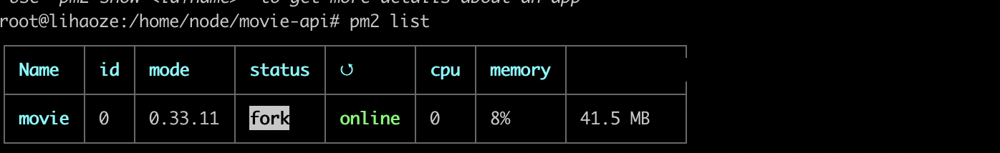

# movie-api

> 参考[慕课网课程](https://coding.imooc.com/class/178.html)使用Koa配合MongoDB数据库为[预告片webApp](https://github.com/lhz960904/movie-trailer)提供后端接口，其数据通过[movie-crawler](https://github.com/lhz960904/movie-crawler)项目爬取得到。部署到服务器上利用PM2启动进程

### PM2命令

```shell
# 进入movie-api项目目录, 用npm启动start 命名为movie
pm2 start npm --name movie -- start
```



### 目录结构
```
├── database     # 数据库相关
├── index.js     # 入口
├── lib          # 封装路由装饰器
├── middlewares  # 中间件()
├── routes       # 路由相关
└── service      # 操作数据库
```

### API

> baseURL => http://47.110.74.37:4000

- 首页推荐  [/api/movie/get_hot](http://47.110.74.37:4000/api/movie/get_hot)
- 不同状态电影  [/api/movie/get_movies?page=1&page_size=10&type=1](http://47.110.74.37:4000/api/movie/get_movies?page=1&page_size=10&type=1)
- 筛选电影  [/api/movie/get_special_movies?categories=[]&rate=[0,10]&type=1](http://47.110.74.37:4000/api/movie/get_special_movies?categories=[]&rate=[0,10]&type=1)
- 榜单电影  [/api/movie/get_rank](http://47.110.74.37:4000/api/movie/get_rank)
- 搜索电影  [/api/movie/search?keyword=大叔](http://47.110.74.37:4000/api/movie/search?keyword=%E5%A4%A7%E5%8F%94)
- 热门搜索词  [/api/movie/get_hot_search](http://47.110.74.37:4000/api/movie/get_hot_search)
- 电影详情 [/api/movie/get_detail/:id](http://47.110.74.37:4000/api/movie/get_detail/5c326c6ad3d97f70eaece53b)
- 收藏或取消收藏电影 [/api/movie/collect/:id](http://47.110.74.37:4000/api/movie/collect/5c326c6ad3d97f70eaece53b)
- 类目列表 [/api/category/get_cates](http://47.110.74.37:4000/api/category/get_cates)
- 注册 /api/user/register  (post请求)
- 登录 /api/user/login       (post请求)
- 注销 /api/user/logout    (post请求)
- 查看收藏 [/api/user/get_collects](http://47.110.74.37:4000/api/user/get_collects)

